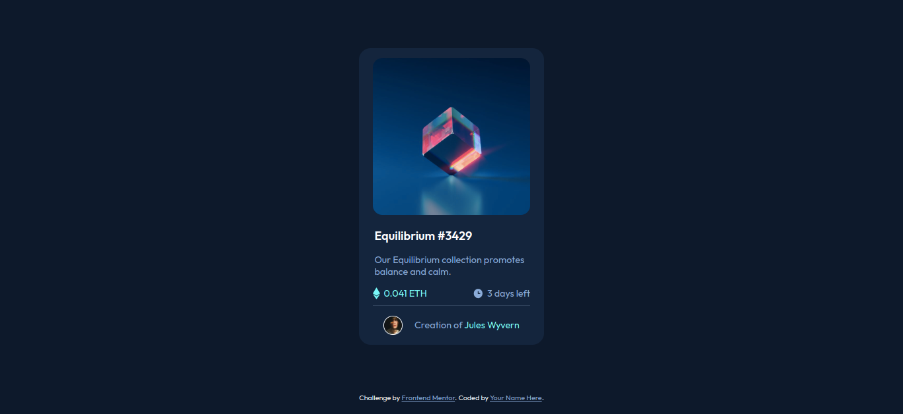

# Frontend Mentor - NFT preview card component solution

This is a solution to the [NFT preview card component challenge on Frontend Mentor](https://www.frontendmentor.io/challenges/nft-preview-card-component-SbdUL_w0U). Frontend Mentor challenges help you improve your coding skills by building realistic projects.
### Screenshot

### Links

- [live site](https://aymennassi.github.io/NFT-preview-card-component/)
### Built with

- Semantic HTML5 markup
- CSS custom properties
- Flexbox
## Author
- Linkedin - [Aymen nassi](https://www.linkedin.com/in/aymen-nassi/)